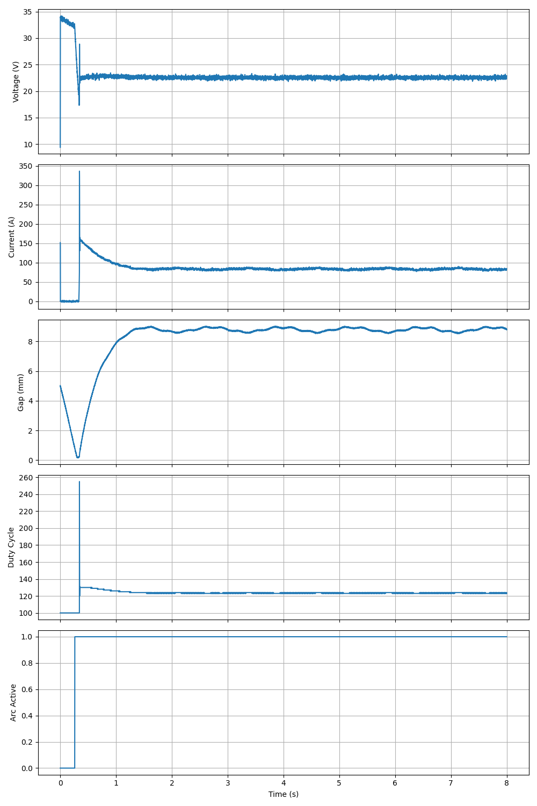
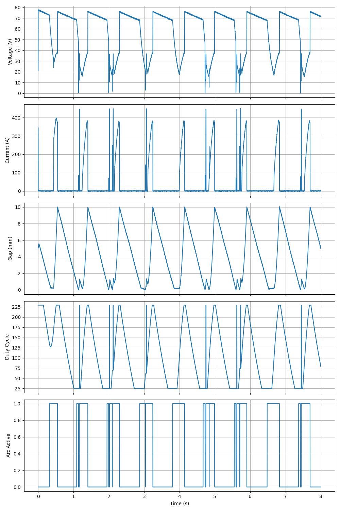

# MIG Arc Welding Controller Optimization

This project focuses on developing and testing robust Arduino-based MIG (Metal Inert Gas) welding controllers. It includes a high-fidelity Hardware-in-the-Loop (HIL) simulation environment and several controller implementations, from primitive logic to advanced PID-based adaptive control.

## Final Evaluation Results

The following table summarizes the performance of each sketch under challenging conditions (0.2V/1.0A Gaussian noise and hand jitter).

| Sketch | Stability | V-Ripple | Startup | Status |
|--------|-----------|----------|---------|--------|
| **[MIG_improved.ino](MIG_improved.ino)** | **100.0%** | **0.21V** | 0.26s | **Optimized** |
| [magic_MIG.ino](magic_MIG.ino) | 100.0% | 0.21V | 0.17s | Optimized |
| [MIG_primitive.ino](MIG_primitive.ino) | 37.0% | 12.35V | 0.32s | Functional |
| [welder.ino](welder.ino) | 0.0% | 99.9V | 8.0s | Incomplete |
| [slow_converging_MIG.ino](slow_converging_MIG.ino) | 0.0% | 99.9V | 8.0s | Incomplete |

### Performance Visualizations

#### Optimized Controller (MIG_improved.ino)
The improved controller uses exponential smoothing and adaptive wire feed to maintain a stable arc despite significant feedback noise.


#### Primitive Controller (MIG_primitive.ino)
The primitive version lacks robust filtering and adaptive control, resulting in lower stability and higher spatter.


---

## Technical Features

1. **HIL Simulation:** Native C++ firmware execution coupled with a Python-based physics engine (`sim/mig_simulator.py`).
2. **Noise Robustness:** Implementation of exponential smoothing filters ($\alpha=0.22$) to handle real-world sensor noise.
3. **Adaptive Control:** Real-time Wire Feed Speed (WFS) adjustment based on current feedback to compensate for hand movement and gap variations.
4. **Mock Environment:** A custom `arduino_mock` library that supports microsecond precision and standardized pin mapping (A0: Volt, A1: Curr, 9: PWM, 10: STEP, 11: DIR).

## How to Test

Run the automated evaluation script:
```bash
python3 evaluate_all.py <sketch_name.ino>
```
This will compile the sketch, run the 8-second simulation, and generate an evaluation plot.
